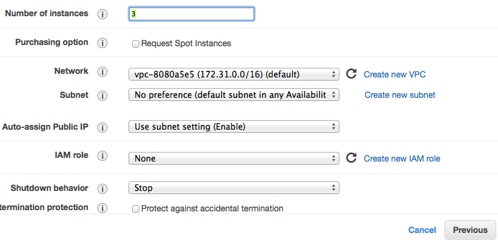
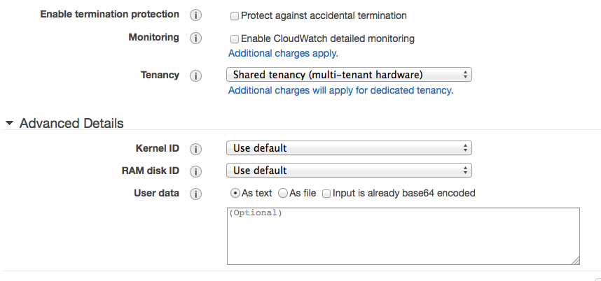

Setup etcd Cluster on AWS
=========================

The goal was to setup a cluster of etcd with three nodes on AWS.
There is a tutorial under https://coreos.com/docs/running-coreos/cloud-providers/ec2/ available which should configure the cluster automatically.
But this doesn`t work very well in our case. For that reason we setup the cluster manually with the help of the tutorial.

== Steps ==

. In the AWS Management Console select the EC2 section and navigate to the overview of your instances. Afterwards click on "Launch Instances".
. In the next step you have to choose your instance image. Here you have to look under the "Community AMI" section for the "ami-7bad4710".
+
---
image::etcd_pics/select_ami.jpg[select_ami, width=500]
---
+
. In the next step of the install wizard you select the type of instance. In our case we need not so much power and selected the "t1.micro"
instance type. Click on "Next: Configure Instance Details".
. Select the number of instance which will form the cluster. Scroll down and open the sub menu "Advanced Settings".
. Now it is necessary to paste some configuration data in the "User data" field. Copy the following config to the "User data" field.
+
----
#cloud-config

coreos:
  etcd:
    # generate a new token for each unique cluster from https://discovery.etcd.io/new?size=<size-of-cluster>
    # specify the initial size of your cluster with ?size=X
    discovery: https://discovery.etcd.io/<token>
    # multi-region and multi-cloud deployments need to use $public_ipv4
    addr: $public_ipv4:4001
    peer-addr: $public_ipv4:7001
  units:
    - name: etcd.service
      command: start
    - name: fleet.service
      command: start

----
+

---

---

. Copy the following URL "https://discovery.etcd.io/new?size=<size-of-cluster>" to your browser and replace
the "<size-of-cluster>" with the count of your cluster members. Following this, copy the URL from the response and replace the example URL from the
"discovery: " field in the configuration in the "User data" section.
+
---
image::etcd_pics/discovery_url.jpg[discovery_url, width=450]
---
+
. Skip the next steps until "Configure Security Groups". Here you have to open Port 4001 and 7001 for Custom TCP and then click on "Preview and Launch".
+
---
image::etcd_pics/security_group.jpg[security_group]
---
+
. In the last step you get an overview over your configuration and then click on "Launch". A window will pop up where you have the possibility
to select or create a new keypair to connect to your instances afterwards. You should select a keypair because maybe you will have a look at the
configuration etc.
+
---
image::etcd_pics/key_pair.jpg[key_pair, width=450]
---
+
. In the last step you can test if the cluster will work correctly. Select the ip address from one member and type following command on your terminal
curl -L http://<ip-address>/version. If there is no error and you will see a version number on your terminal you have configured the cluster successfull.
